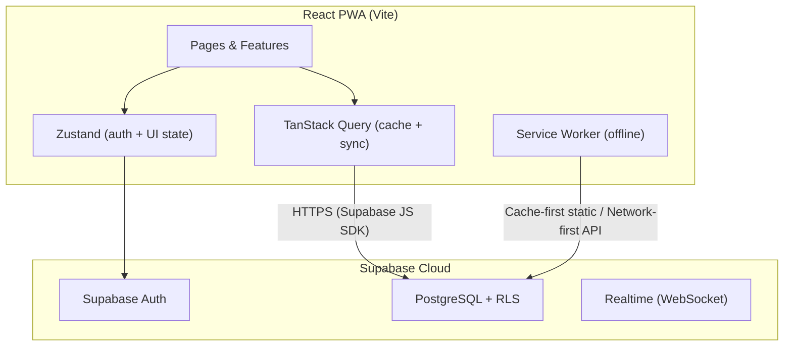
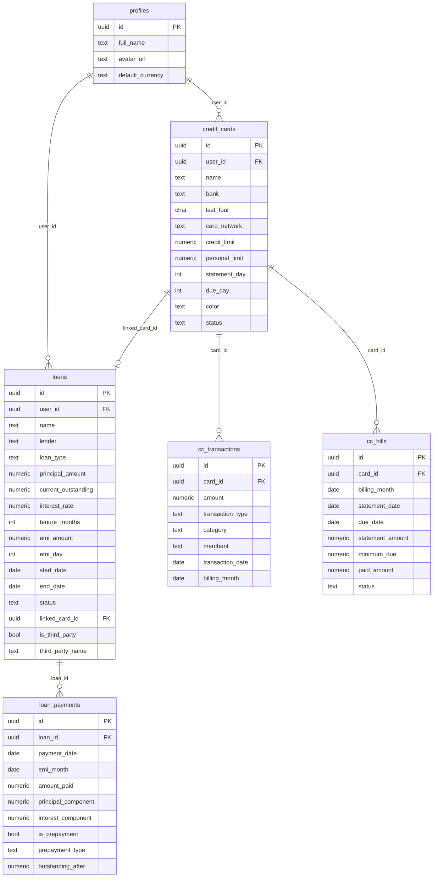
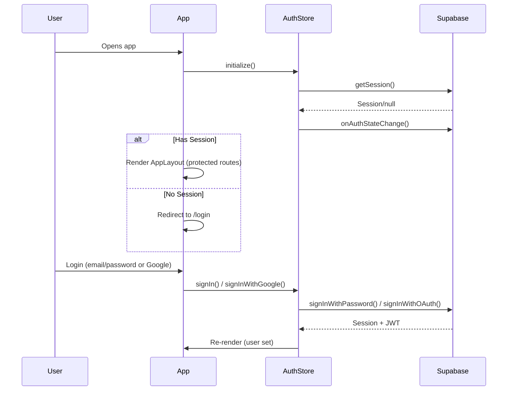

# Z-RHO — Complete Application Walkthrough

> **Z-RHO** (originally spec'd as "DebtWise") is a full-stack, mobile-first **Personal Debt Lifecycle Manager** — a PWA for tracking loans and credit card debts with automated financial math, visual progress, and prepayment simulators.
>
> Built by [Hariharen](https://hariharen.site) with React 18 + TypeScript + Vite + Supabase.

---

## 1. High-Level Architecture



| Concern | Solution |
|---------|----------|
| **Framework** | React 19 + TypeScript + Vite 8 |
| **Styling** | Tailwind CSS v4 (native CSS config) + Framer Motion |
| **State** | Zustand (auth + UI) · TanStack React Query v5 (server data) |
| **Forms** | React Hook Form + Zod |
| **Charts** | Recharts |
| **Database** | Supabase PostgreSQL with strict Row-Level Security |
| **Auth** | Supabase Auth (email/password + Google OAuth) |
| **PWA** | vite-plugin-pwa (Workbox) |
| **Hosting** | Vercel (SPA rewrites + security headers) |
| **Icons** | Lucide React |
| **Dates** | date-fns |

---

## 2. Project Structure

```
zrho/
├── index.html                 # HTML shell (Inter font, PWA meta tags, dark bg)
├── vite.config.ts             # Vite + React + Tailwind + PWA plugin + chunk splitting
├── vercel.json                # Security headers, SPA rewrites, cache policies
├── package.json               # Dependencies & scripts
│
├── public/                    # Static assets (PWA icons, logos)
├── supabase/migrations/       # 10 SQL migration files (schema + RLS + triggers)
│
└── src/
    ├── main.tsx               # React root: QueryClient + BrowserRouter + PWA register
    ├── App.tsx                # Route definitions + auth init + theme application
    │
    ├── lib/                   # Core utilities (no UI)
    │   ├── supabase.ts        # Supabase client singleton
    │   ├── calculations.ts    # THE MATH ENGINE (EMI, amortization, prepayment, billing)
    │   ├── currency.ts        # Intl.NumberFormat formatting + cross-currency conversion
    │   ├── dates.ts           # date-fns wrappers
    │   ├── constants.ts       # Enums, currencies, exchange rates, color maps
    │   └── exportLedger.ts    # CSV/JSON/PDF export pipeline (1029 lines)
    │
    ├── types/                 # TypeScript types
    │   ├── database.types.ts  # Hand-written Supabase row types + Insert/Update helpers
    │   ├── loan.types.ts      # AmortizationRow, LoanStats, PrepaymentImpact
    │   ├── card.types.ts      # SPEND_CATEGORIES, CardStats, CategoryBreakdown
    │   └── common.types.ts    # CurrencyInfo, DueInfo, UpcomingPayment, DashboardSummary
    │
    ├── store/                 # Zustand stores
    │   ├── authStore.ts       # User/session/loading + signIn/signUp/Google/signOut/reset
    │   └── uiStore.ts         # Theme (light/dark/system) + sidebar state, persisted
    │
    ├── hooks/                 # TanStack Query hooks (data layer)
    │   ├── useAuth.ts         # Convenience wrapper around authStore
    │   ├── useLoans.ts        # CRUD: useLoans, useLoan, useCreateLoan, useUpdateLoan, useDeleteLoan
    │   ├── useLoanPayments.ts # useRecordPayment, useRecordPrepayment, useDeletePayment
    │   ├── useCards.ts        # CRUD: useCards, useCard, useCreateCard, useUpdateCard, useDeleteCard
    │   ├── useTransactions.ts # Filtered queries + CRUD for cc_transactions
    │   ├── useBills.ts        # useBills, useCurrentBill, useCreateBill, useMarkBillPaid, useUpdateBill
    │   ├── useDashboard.ts    # Aggregated stats, upcoming payments, debt history, monthly outflow
    │   └── useProfile.ts      # useProfile, useUpdateProfile, useDeleteAccount
    │
    ├── components/
    │   ├── ui/                # Generic UI primitives
    │   │   ├── Button.tsx, Card.tsx, Badge.tsx
    │   │   ├── Modal.tsx, ConfirmModal.tsx
    │   │   ├── DatePicker.tsx  # Fully bespoke (no library)
    │   │   ├── Dropdown.tsx    # Framer Motion glassmorphic select
    │   │   └── ProgressBar.tsx
    │   ├── shared/            # Domain-aware shared components
    │   │   ├── AmountDisplay.tsx, AnimatedNumber.tsx
    │   │   ├── BankLogo.tsx, CardNetworkLogo.tsx  # Dynamic SVG renderers
    │   │   ├── DateCountdown.tsx, Progress.tsx
    │   └── layout/
    │       ├── AppLayout.tsx      # Sidebar (desktop) + BottomTabBar (mobile) + content
    │       ├── AuthLayout.tsx     # Centered card layout for login/signup
    │       ├── Sidebar.tsx        # Collapsible nav with icons
    │       └── BottomTabBar.tsx   # Mobile bottom navigation
    │
    ├── features/              # Feature-based page modules
    │   ├── auth/              # LoginPage, SignupPage, ForgotPasswordPage, ProtectedRoute
    │   ├── dashboard/         # DashboardPage + SummaryCards, UpcomingPayments, Charts, Overviews
    │   ├── loans/             # LoansPage, LoanForm, LoanDetailPage, AmortizationTable, Modals
    │   ├── cards/             # CardsPage, CardForm, CardDetailPage, BillDetailPage, Modals
    │   └── settings/          # SettingsPage (profile, currency, theme, danger zone)
    │
    └── styles/
        └── globals.css        # Tailwind v4 @theme tokens + oklch design system + glass utilities
```

---

## 3. Database Schema (Supabase PostgreSQL)

10 migration files establish 6 core tables, RLS policies, triggers, and 3 extension columns:



### Key Schema Details

| Migration | Purpose |
|-----------|---------|
| [001_profiles.sql](file:///e:/Projects/zrho/supabase/migrations/001_profiles.sql) | `profiles` table, auto-created on signup via trigger |
| [002_loans.sql](file:///e:/Projects/zrho/supabase/migrations/002_loans.sql) | `loans` table with all financial fields |
| [003_loan_payments.sql](file:///e:/Projects/zrho/supabase/migrations/003_loan_payments.sql) | `loan_payments` with principal/interest breakdown |
| [004_credit_cards.sql](file:///e:/Projects/zrho/supabase/migrations/004_credit_cards.sql) | `credit_cards` table |
| [005_cc_transactions.sql](file:///e:/Projects/zrho/supabase/migrations/005_cc_transactions.sql) | `cc_transactions` with billing month tracking |
| [006_cc_bills.sql](file:///e:/Projects/zrho/supabase/migrations/006_cc_bills.sql) | `cc_bills` with lifecycle statuses |
| [007_delete_account.sql](file:///e:/Projects/zrho/supabase/migrations/007_delete_account.sql) | `SECURITY DEFINER` RPC function `delete_account()` |
| [009_linked_loans.sql](file:///e:/Projects/zrho/supabase/migrations/009_linked_loans.sql) | Adds `linked_card_id` to loans (CC EMI linking) |
| [010_third_party_loans.sql](file:///e:/Projects/zrho/supabase/migrations/010_third_party_loans.sql) | Adds `is_third_party` + `third_party_name` to loans |
| [011_personal_limits.sql](file:///e:/Projects/zrho/supabase/migrations/011_personal_limits.sql) | Adds `personal_limit` to credit_cards |

### Security

- **RLS on every table**: `auth.uid() = user_id` for SELECT/INSERT/UPDATE/DELETE
- **Profiles**: `auth.uid() = id`
- **No service role key** in frontend — RLS is the security layer
- **Cascading deletes**: loan_payments, cc_transactions, cc_bills cascade from parent
- **Account deletion**: Server-side function deletes from `auth.users`, cascading everything

---

## 4. Authentication Flow

Managed entirely by [authStore.ts](file:///e:/Projects/zrho/src/store/authStore.ts):



- **Auth methods**: Email/password + Google OAuth
- **Protected routes**: [ProtectedRoute](file:///e:/Projects/zrho/src/features/auth/ProtectedRoute.tsx) wraps all app routes
- **Password recovery**: `PASSWORD_RECOVERY` event sets `isRecoveringPassword` flag → in-app password update form
- **Session persistence**: Supabase client auto-refreshes tokens, stores in localStorage

---

## 5. State Management

### Zustand Stores (Client-Side State)

| Store | File | Persisted? | Purpose |
|-------|------|------------|---------|
| `authStore` | [authStore.ts](file:///e:/Projects/zrho/src/store/authStore.ts) | No | User, session, loading, auth actions |
| `uiStore` | [uiStore.ts](file:///e:/Projects/zrho/src/store/uiStore.ts) | Theme only | Theme (light/dark/system), sidebar open/close |

### TanStack Query (Server-Side State)

All data fetching goes through TanStack Query hooks in [src/hooks/](file:///e:/Projects/zrho/src/hooks):

| Hook File | Query Keys | Operations |
|-----------|-----------|------------|
| [useLoans.ts](file:///e:/Projects/zrho/src/hooks/useLoans.ts) | `['loans', ...]` | List, single, create, update, delete |
| [useLoanPayments.ts](file:///e:/Projects/zrho/src/hooks/useLoanPayments.ts) | `['loan_payments', ...]` | Record EMI, record prepayment, delete payment |
| [useCards.ts](file:///e:/Projects/zrho/src/hooks/useCards.ts) | `['credit_cards', ...]` | List, single, create, update, delete |
| [useTransactions.ts](file:///e:/Projects/zrho/src/hooks/useTransactions.ts) | `['cc_transactions', ...]` | Filtered list, create, update, delete |
| [useBills.ts](file:///e:/Projects/zrho/src/hooks/useBills.ts) | `['cc_bills', ...]` | List, current, create, mark paid, update |
| [useDashboard.ts](file:///e:/Projects/zrho/src/hooks/useDashboard.ts) | `['dashboard', ...]` | Summary stats, upcoming payments, debt history, monthly outflow |
| [useProfile.ts](file:///e:/Projects/zrho/src/hooks/useProfile.ts) | `['profile', ...]` | Read, update, delete account |

**Query defaults** (from [main.tsx](file:///e:/Projects/zrho/src/main.tsx)):
- `staleTime: 30s`
- `retry: 1`
- `refetchOnWindowFocus: false`

**Cache invalidation pattern**: All mutations call `queryClient.invalidateQueries()` on success, invalidating related query keys to trigger refetch.

---

## 6. The Math Engine

[calculations.ts](file:///e:/Projects/zrho/src/lib/calculations.ts) (495 lines) is the financial brain of the app:

### EMI Calculation
```
EMI = P × r × (1 + r)^n / ((1 + r)^n - 1)
where r = annual_rate / 12 / 100, n = tenure_months
```

### Amortization Schedule Generation
Generates a month-by-month array of `AmortizationRow` objects. For each month:
- Calculates interest & principal components
- Cross-references actual `LoanPayment` records to mark rows as **paid/current/upcoming**
- Handles prepayments by tracking outstanding balance from payment records
- Self-heals if EMI is 0 (recalculates from principal/rate/tenure)

### Loan Statistics (`calculateLoanStats`)
Derives from loan data + payment history:
- `percentPaid`, `emisPaid`, `emisRemaining` (dynamically calculated from remaining principal)
- `totalInterestPaid`, `totalInterestRemaining` (iterative loop over remaining months)
- `projectedPayoffDate` (based on actual remaining balance, not original schedule)
- `interestSaved` (difference between original total interest and actual + projected)

### Prepayment Impact Calculator
Strategy: keep EMI same → reduce tenure.
- Calculates new outstanding after prepayment
- Uses `n = -log(1 - P*r/EMI) / log(1+r)` to find new tenure
- Simulates both original and new remaining interest iteratively
- Returns: `interestSaved`, `monthsSaved`, `newTenureMonths`

### Credit Card Logic
- **Utilization**: `(currentBalance / creditLimit) × 100`
- **Current Balance**: `sum(debits) - sum(credits)` from transactions
- **Billing Month Detection**: Transaction date vs statement_day determines which cycle
- **Bill Dates**: Calculates statement_date and due_date from statement_day/due_day

### Due Date Status
Color-coded urgency system:
- `> 7 days` → 🟢 safe
- `3-7 days` → 🟡 warning  
- `< 3 days` → 🔴 danger
- `past due` → 🔴 overdue (with "X days overdue" label)

---

## 7. Multi-Currency System

[currency.ts](file:///e:/Projects/zrho/src/lib/currency.ts) + [constants.ts](file:///e:/Projects/zrho/src/lib/constants.ts):

- **10 supported currencies**: INR, USD, EUR, GBP, AED, SGD, CAD, AUD, JPY, CHF
- **Hardcoded exchange rates** (v1 simplicity) relative to INR as base
- **Conversion**: `from → INR → to` using `EXCHANGE_RATES_TO_INR`
- **Formatting**: `Intl.NumberFormat` with locale-aware display
- **Compact display**: INR uses Lakhs/Crores, others use standard K/M/B notation
- **Per-entity currency**: Each loan and card stores its own currency
- **Dashboard aggregation**: Converts everything to user's `default_currency` from profile

---

## 8. Feature Modules

### 8.1 Dashboard ([DashboardPage.tsx](file:///e:/Projects/zrho/src/features/dashboard/DashboardPage.tsx) — 43K)

The largest single component. Aggregates all data:

- **Summary Cards**: Total outstanding debt, this month's obligations, credit limit, available credit
- **Upcoming Payments**: Next 30 days of EMIs + CC bills, color-coded by urgency, navigable
- **Loans Overview**: Active loans as compact cards with progress bars and quick "Mark EMI Paid"
- **Cards Overview**: Horizontal scroll of styled credit cards with utilization rings
- **Debt Reduction Chart**: Recharts line chart showing 12-month outstanding debt trajectory
- **Monthly Outflow Chart**: Stacked bar chart — EMIs vs CC payments over 6 months

Uses 4 dedicated hooks from [useDashboard.ts](file:///e:/Projects/zrho/src/hooks/useDashboard.ts):
`useDashboardStats`, `useUpcomingPayments`, `useDebtHistory`, `useMonthlyOutflow`

---

### 8.2 Loans Module

| File | Size | Purpose |
|------|------|---------|
| [LoansPage.tsx](file:///e:/Projects/zrho/src/features/loans/LoansPage.tsx) | 10K | List view with active/closed toggle, sort, FAB |
| [LoanCard.tsx](file:///e:/Projects/zrho/src/features/loans/LoanCard.tsx) | 5K | Individual loan card with progress bar, stats |
| [LoanForm.tsx](file:///e:/Projects/zrho/src/features/loans/LoanForm.tsx) | 30K | Add/edit with live EMI calculation as-you-type |
| [LoanDetailPage.tsx](file:///e:/Projects/zrho/src/features/loans/LoanDetailPage.tsx) | 50K | Full detail view with all sections |
| [AmortizationTable.tsx](file:///e:/Projects/zrho/src/features/loans/AmortizationTable.tsx) | 3K | Month-by-month schedule table |
| [LoanPaymentHistory.tsx](file:///e:/Projects/zrho/src/features/loans/LoanPaymentHistory.tsx) | 2K | Payments timeline |
| [MarkEmiPaidModal.tsx](file:///e:/Projects/zrho/src/features/loans/MarkEmiPaidModal.tsx) | 4K | EMI payment confirmation |
| [PrepaymentModal.tsx](file:///e:/Projects/zrho/src/features/loans/PrepaymentModal.tsx) | 6K | Prepayment form with impact preview |

**Key flows:**
1. **Live EMI Calculation**: Form uses `calculateEMI()` on every keystroke to show real-time EMI, total interest, and total payable
2. **Mark EMI Paid**: Calculates principal/interest breakdown via `calculateEMIBreakdown()`, updates `current_outstanding`, auto-closes loan if outstanding hits 0
3. **Prepayment Simulator**: Before submitting, shows `calculatePrepaymentImpact()` results — months saved, interest saved, new tenure
4. **Third-party loans**: `is_third_party` flag + `third_party_name` field for loans from individuals (excluded from dashboard debt totals)
5. **Linked card**: `linked_card_id` FK associates CC EMI loans with a specific credit card

---

### 8.3 Credit Cards Module

| File | Size | Purpose |
|------|------|---------|
| [CardsPage.tsx](file:///e:/Projects/zrho/src/features/cards/CardsPage.tsx) | 16K | Card grid with visual card representations |
| [CreditCardVisual.tsx](file:///e:/Projects/zrho/src/features/cards/CreditCardVisual.tsx) | 5K | Stylized card graphic (gradient, bank logo, network logo) |
| [CardForm.tsx](file:///e:/Projects/zrho/src/features/cards/CardForm.tsx) | 25K | Add/edit with **preset gradient swatches** for color |
| [CardDetailPage.tsx](file:///e:/Projects/zrho/src/features/cards/CardDetailPage.tsx) | 63K | Biggest file — transactions, bills, charts, spending analysis |
| [AddCCTransactionModal.tsx](file:///e:/Projects/zrho/src/features/cards/AddCCTransactionModal.tsx) | 18K | Full transaction form with category grid |
| [BillDetailPage.tsx](file:///e:/Projects/zrho/src/features/cards/BillDetailPage.tsx) | 14K | Individual billing cycle detail + payment |
| [TransactionList.tsx](file:///e:/Projects/zrho/src/features/cards/TransactionList.tsx) | 4K | Filterable transaction history |
| [BillsList.tsx](file:///e:/Projects/zrho/src/features/cards/BillsList.tsx) | 2K | Billing cycles list |
| [MarkBillPaidModal.tsx](file:///e:/Projects/zrho/src/features/cards/MarkBillPaidModal.tsx) | 6K | Bill payment (supports partial payments) |

**Key flows:**
1. **Visual card rendering**: Dynamic gradient colors (10 preset swatches), bank logos via SVG parsing ([BankLogo.tsx](file:///e:/Projects/zrho/src/components/shared/BankLogo.tsx)), network logos ([CardNetworkLogo.tsx](file:///e:/Projects/zrho/src/components/shared/CardNetworkLogo.tsx))
2. **Transaction creation**: Auto-detects `billing_month` from `transaction_date + statement_day` via `determineBillingMonth()`
3. **Bill lifecycle**: `upcoming → generated → paid/partially_paid/overdue`
4. **Partial payments**: `useMarkBillPaid` accumulates `paid_amount` across multiple payments
5. **Personal spending limit**: Optional `personal_limit` field on credit cards (separate from bank's credit limit)
6. **14 spend categories**: From "Food & Dining" to "Other"

---

### 8.4 Settings ([SettingsPage.tsx](file:///e:/Projects/zrho/src/features/settings/SettingsPage.tsx) — 21K)

- **Profile**: Full name, avatar URL, email (display only)
- **Default Currency**: Selector from 10 supported currencies
- **Theme**: Light / Dark / System toggle
- **Password**: Change password (uses `authStore.updatePassword`)
- **Export Center**: CSV / JSON / PDF export for loans and cards
- **Danger Zone**: Delete account with confirmation (calls `delete_account()` RPC)

---

## 9. Design System

[globals.css](file:///e:/Projects/zrho/src/styles/globals.css) establishes a premium design system:

### Theming
- **oklch color space** throughout for perceptual uniformity
- **Dark mode default**: True black (`oklch(0 0 0)`) backgrounds, `#121212` surfaces
- **Light mode override**: Clean whites/grays
- **Theme tokens**: `--background`, `--foreground`, `--surface`, `--surface-elevated`, `--primary`, `--secondary`, `--muted`, `--accent`, `--destructive`, `--success`, `--warning`, `--info`, `--border`, `--input`, `--ring`

### Typography
- **Inter** (Google Fonts) as primary display font
- **JetBrains Mono** for monospace
- **Tabular numerals** utility class `.tabular` for aligned financial figures

### Utilities
- `.glass-card`: Glassmorphic card with linear gradient + semi-transparent border
- `.card-shine`: Radial gradient highlight effect for elevated cards
- `.btn-shiny`: Premium animated button with sweeping shine animation

### Animations
- Framer Motion page transitions
- Staggered card entrance animations
- Animated progress bars
- Custom DatePicker and Dropdown with spring animations

---

## 10. Export System

[exportLedger.ts](file:///e:/Projects/zrho/src/lib/exportLedger.ts) (1029 lines) provides a full data export pipeline:

| Format | Loans | Cards |
|--------|-------|-------|
| **JSON** | Full loan + payments enriched data | Full cards + transactions + bills enriched data |
| **CSV** | 21-column loan registry with payment summaries | Transaction-level spending ledger per card |
| **PDF** | Vector HTML report: summary stats, loan registry table, individual repayment schedules | Card portfolio report with utilization, category breakdown, billing history |

PDF export uses a hidden `<iframe>` with `window.print()` — creates fully styled A4 vector reports with:
- Z-RHO branded header
- Summary statistics grid
- Data tables with progress bars and status badges
- Individual section breakdowns
- Print-optimized CSS with page-break rules

---

## 11. PWA Configuration

From [vite.config.ts](file:///e:/Projects/zrho/vite.config.ts):

- **Auto-update** registration
- **Manifest**: App name "ZRHO — Debt Manager", standalone display, dark theme colors
- **Icons**: 192×192, 512×512, 512×512 maskable
- **Workbox caching**: Supabase API calls use `NetworkFirst` with 24hr cache fallback
- **Static assets**: Cache-first (implicit via Workbox defaults)

---

## 12. Build & Deployment

### Vite Build Optimization
Manual chunk splitting for optimal loading:

| Chunk | Contents |
|-------|----------|
| `vendor-core` | React, React DOM, React Router, TanStack Query, Zustand |
| `vendor-charts` | Recharts, D3, react-resize-detector |
| `vendor-motion` | Framer Motion |
| `vendor-icons` | Lucide React |
| `vendor-utils` | Everything else from node_modules |

### Vercel Deployment ([vercel.json](file:///e:/Projects/zrho/vercel.json))
- **SPA rewrite**: All routes → `/index.html`
- **Security headers**: `X-Content-Type-Options`, `X-Frame-Options`, `X-XSS-Protection`, `Referrer-Policy`, `Permissions-Policy`
- **Service worker**: No caching (`must-revalidate`)
- **Assets**: 1-year immutable cache
- **Manifest**: No cache

---

## 13. Routes Map

| Route | Component | Description |
|-------|-----------|-------------|
| `/` | Redirect → `/dashboard` | Root redirect |
| `/login` | [LoginPage](file:///e:/Projects/zrho/src/features/auth/LoginPage.tsx) | Email/password + Google OAuth |
| `/signup` | [SignupPage](file:///e:/Projects/zrho/src/features/auth/SignupPage.tsx) | Registration |
| `/forgot-password` | [ForgotPasswordPage](file:///e:/Projects/zrho/src/features/auth/ForgotPasswordPage.tsx) | Reset via email |
| `/dashboard` | [DashboardPage](file:///e:/Projects/zrho/src/features/dashboard/DashboardPage.tsx) | Aggregated overview |
| `/loans` | [LoansPage](file:///e:/Projects/zrho/src/features/loans/LoansPage.tsx) | All loans list |
| `/loans/new` | [LoanForm](file:///e:/Projects/zrho/src/features/loans/LoanForm.tsx) | Add loan |
| `/loans/:id` | [LoanDetailPage](file:///e:/Projects/zrho/src/features/loans/LoanDetailPage.tsx) | Loan detail |
| `/loans/:id/edit` | [LoanForm](file:///e:/Projects/zrho/src/features/loans/LoanForm.tsx) | Edit loan |
| `/cards` | [CardsPage](file:///e:/Projects/zrho/src/features/cards/CardsPage.tsx) | All cards list |
| `/cards/new` | [CardForm](file:///e:/Projects/zrho/src/features/cards/CardForm.tsx) | Add card |
| `/cards/:id` | [CardDetailPage](file:///e:/Projects/zrho/src/features/cards/CardDetailPage.tsx) | Card detail |
| `/cards/:id/edit` | [CardForm](file:///e:/Projects/zrho/src/features/cards/CardForm.tsx) | Edit card |
| `/cards/:id/bill/:billId` | [BillDetailPage](file:///e:/Projects/zrho/src/features/cards/BillDetailPage.tsx) | Bill detail |
| `/settings` | [SettingsPage](file:///e:/Projects/zrho/src/features/settings/SettingsPage.tsx) | Profile, currency, theme, export, danger zone |

---

## 14. Beyond-Spec Extensions

The codebase extends beyond the original `ZRHO_MASTER_SPEC.md` in several ways:

| Extension | Implementation |
|-----------|---------------|
| **Linked Loans** (migration 009) | `linked_card_id` FK on loans lets users associate credit card EMI loans with their card |
| **Third-Party Loans** (migration 010) | `is_third_party` flag + `third_party_name` for tracking personal borrowing (excluded from debt totals) |
| **Personal Spending Limits** (migration 011) | `personal_limit` on credit cards — separate from bank limit, for self-imposed spending discipline |
| **Export Center** | Full CSV/JSON/PDF export pipeline (not in v1 spec's non-goals, but implemented anyway) |
| **Custom DatePicker** | Fully bespoke month-over-month chevron navigation datepicker (no library dependency) |
| **Custom Dropdown** | Framer Motion glassmorphic select with spring animations |
| **Dynamic Bank/Network Logos** | SVG parsers for Chase, SBI, HDFC, ICICI, Citi, HSBC, Visa, Mastercard, Amex, RuPay |
| **Animated Numbers** | Counter animations for large financial values |
| **Preset Color Swatches** | 10 curated gradient swatches for card colors instead of a raw color picker |

---

## 15. Key Patterns & Conventions

1. **Every file starts with a `// ZRHO —` banner comment**
2. **Feature-based organization**: Pages and their sub-components live together in `features/`
3. **Hooks encapsulate all Supabase calls** — components never call `supabase` directly
4. **Mutations auto-invalidate related queries** via `onSuccess` callbacks
5. **Auto-calculation on forms**: EMI, total interest, end date, billing month all computed on the fly
6. **Self-healing math**: If EMI is 0 or missing, the math engine recalculates from principal/rate/tenure
7. **`round2()` everywhere**: All financial calculations use 2-decimal precision rounding
8. **Path aliases**: `@/` → `src/` via Vite `resolve.alias`
9. **Type helpers**: `LoanInsert`, `LoanUpdate`, etc. use TypeScript `Omit`/`Partial` for type-safe DB operations
10. **No raw `confirm()`** — all confirmations use the custom [ConfirmModal](file:///e:/Projects/zrho/src/components/ui/ConfirmModal.tsx)
